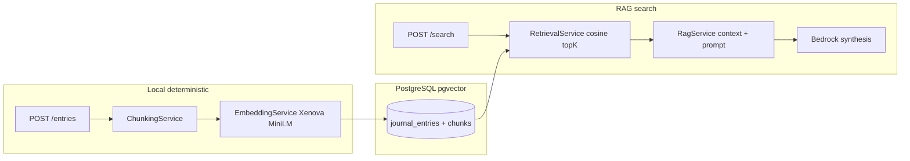

# Memrider — Personal Memory Search (V1)

A minimal **hybrid RAG memory engine** with evaluation-first design.

> Ask your past self using semantic memory retrieval.

## Architecture




| Layer     | Responsibility                                           |
| --------- | -------------------------------------------------------- |
| **Local** | Chunking, embedding (Xenova/all-MiniLM-L6-v2), retrieval |
| **Cloud** | Answer synthesis only (Amazon Bedrock)                   |


## Monorepo layout

```
apps/
  api/     NestJS REST API
  web/     Next.js App Router UI
packages/
  database/   Prisma + pgvector schema
  shared/     Zod schemas (MemoryAnswer, eval fixtures)
```

## Quick start

### 1. Infrastructure

```bash
docker compose up -d
```

- Postgres + pgvector: `localhost:5432`
- pgAdmin: `http://localhost:5050` ([admin@memrider.local](mailto:admin@memrider.local) / admin)

### 2. Install & migrate

Requires **Node.js ≥ 20.19** (Prisma 7; `.nvmrc` pins 22).

```bash
cp .env.example .env
pnpm install
pnpm db:generate
pnpm db:migrate
```

Optional seed for eval:

```bash
pnpm --filter @memrider/database seed
```

**Prisma + pgvector:** keep using migrations; review generated SQL so Prisma does not drop the HNSW index. See [packages/database/MIGRATIONS.md](packages/database/MIGRATIONS.md).

### 3. Run

```bash
pnpm dev
```

- API: `http://localhost:3001`
- Web: `http://localhost:3000` → `/write`, `/search`, `/entries`

## API


| Method | Path                    | Description                      |
| ------ | ----------------------- | -------------------------------- |
| `POST` | `/entries`              | Store entry, chunk, embed, index |
| `GET`  | `/entries`              | List entries                     |
| `POST` | `/search`               | RAG: retrieve + Bedrock answer   |
| `POST` | `/evaluation/retrieval` | Retrieval hit-rate eval          |


### Search response (structured)

```json
{
  "answer": "...",
  "supportingChunkIds": ["..."],
  "confidence": "medium",
  "retrieved": [{ "id", "content", "similarity" }],
  "meta": { "latencyMs": 1200 }
}
```

## Evaluation

Built-in checks (not external-only):

- **Retrieval hit rate** — `relevant_chunks_found / total_queries`
- **Hallucination guard** — `supportingChunkIds` must ⊆ retrieved chunk IDs
- **Schema validation** — `MemoryAnswerSchema` (Zod)
- **Regression** — `pnpm test` + `pnpm eval`

Live retrieval eval against DB:

```bash
RUN_LIVE_EVAL=1 pnpm eval
```

Update [apps/api/src/evaluation/fixtures/retrieval-eval.json](apps/api/src/evaluation/fixtures/retrieval-eval.json) with real chunk IDs after seeding.

## Prompt management

Prompts live as **versioned files**, not hard-coded strings:

```
apps/api/prompt-registry/memory-search/
  manifest.json      # versions + default
  v1/
    system.md        # system instructions
    user.md          # user template ({{query}}, {{memories}})
```

Switch the active version without code changes:

```bash
PROMPT_MEMORY_SEARCH_VERSION=v1   # default in manifest.json
```

To add `v2`, create `v1/` copies, edit, register in `manifest.json`, then set the env var. Search responses and logs include `meta.promptName` and `meta.promptVersion` for regression tracking.

## Observability

Each `/search` request logs JSON: query, prompt version, retrieved chunk IDs, similarities, system/user prompts, answer, latency.

## Bedrock

Set `AWS_REGION`, `BEDROCK_MODEL_ID`, and `AWS_BEARER_TOKEN_BEDROCK` (Bedrock API key). Nova models use the Converse API with bearer auth. Without these, the API uses a **deterministic mock LLM** that still returns valid structured JSON.

## Non-goals (V1)

No agents, workflows, emotion taxonomies, memory graphs, or multi-step reasoning chains.