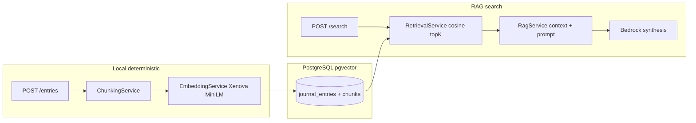

# Memrider — Personal Memory Search (V1)

A minimal **hybrid RAG memory engine** with evaluation-first design.

> Ask your past self using semantic memory retrieval.

## Architecture




| Layer     | Responsibility                                        |
| --------- | ----------------------------------------------------- |
| **Local** | Chunking, embedding (`EMBEDDING_MODEL_ID`), retrieval |
| **Cloud** | Answer synthesis only (Amazon Bedrock)                |


| Package             | Role                                                     |
| ------------------- | -------------------------------------------------------- |
| `apps/api`          | HTTP controllers, eval CLI (`eval:seed`, `eval`, sync)   |
| `packages/journal`  | Journal domain: entries, chunks, retrieval, RAG, prompts |
| `packages/database` | Prisma schema and migrations                             |
| `packages/shared`   | Config, Zod API contracts                                |


## Monorepo layout

```
apps/
  api/     NestJS REST API
  web/     Next.js App Router UI
packages/
  database/   Prisma + pgvector schema
  shared/     Zod schemas (MemoryAnswer, eval fixtures)
```

## Quick start

### 1. Infrastructure

```bash
docker compose up -d
```

- Postgres
- pgAdmin (see env vars for url and credentials)

### 2. Install & migrate

```bash
cp .env.example .env
pnpm install
pnpm db:generate
pnpm db:deploy
```

`db:deploy` applies the existing migrations in `packages/database/prisma/migrations/` (tables, pgvector, HNSW index). Use `pnpm db:migrate` only when **changing** the Prisma schema — that runs `prisma migrate dev`, which can prompt for a new migration name.

Optional eval seed and fixture sync:

```bash
pnpm --filter @memrider/api eval:seed
pnpm --filter @memrider/api eval:sync-fixture
```

**`eval:seed`** loads eval journal entries through the same `ChunkingService` + embed path as `POST /entries`. 

`eval:sync-fixture` reads [retrieval-eval.spec.json](apps/api/src/evaluation/fixtures/retrieval-eval.spec.json), resolves chunk IDs from the seeded DB, and writes [retrieval-eval.json](apps/api/src/evaluation/fixtures/retrieval-eval.json). Run both after a DB reset, before `RUN_LIVE_EVAL=1 pnpm eval`.

**Prisma + pgvector migrations:** review generated SQL so Prisma does not drop the HNSW index. See [packages/database/MIGRATIONS.md](packages/database/MIGRATIONS.md).

### 3. Run

```bash
pnpm dev
```

- API: `http://localhost:3001`
- Web: `http://localhost:3000` → `/write`, `/search`, `/entries`

## API


| Method | Path                    | Description                      |
| ------ | ----------------------- | -------------------------------- |
| `POST` | `/entries`              | Store entry, chunk, embed, index |
| `GET`  | `/entries`              | List entries                     |
| `POST` | `/search`               | RAG: retrieve + Bedrock answer   |
| `POST` | `/evaluation/retrieval` | Retrieval hit-rate eval          |


### Search response (structured)

```json
{
  "answer": "...",
  "supportingChunkIds": ["..."],
  "confidence": "medium",
  "retrieved": [{ "id", "content", "similarity" }],
  "meta": { "latencyMs": 1200 }
}
```

## Evaluation

Built-in checks (not external-only):

- **Retrieval hit rate** — `relevant_chunks_found / total_queries`
- **Hallucination guard** — `supportingChunkIds` must ⊆ retrieved chunk IDs
- **Schema validation** — `MemoryAnswerSchema` (Zod)
- **Regression** — `pnpm --filter @memrider/journal test` + `pnpm eval`

### Retrieval eval fixtures

Two files, two roles:


| File                                                                                  | Maintained by | Contents                                                          |
| ------------------------------------------------------------------------------------- | ------------- | ----------------------------------------------------------------- |
| [retrieval-eval.spec.json](apps/api/src/evaluation/fixtures/retrieval-eval.spec.json) | You (in git)  | Test queries, `seedKey`, and which chunk index should match       |
| [retrieval-eval.json](apps/api/src/evaluation/fixtures/retrieval-eval.json)           | Generated     | Same queries with concrete `expectedChunkIds` from the current DB |


After seeding or resetting the database, sync the generated file:

```bash
pnpm --filter @memrider/api eval:sync-fixture
```

The script finds each seed entry by its `[memrider-seed:…]` marker, maps `expectedChunkIndexes` to chunk rows (same order as `ChunkingService` output), and overwrites `retrieval-eval.json`. Without this step, live eval compares queries against stale chunk IDs from a previous seed.

Live retrieval eval against DB:

```bash
RUN_LIVE_EVAL=1 pnpm eval
```

Commit changes to `retrieval-eval.spec.json` when you add cases; commit `retrieval-eval.json` too if you want CI or other devs to skip the sync step after seed.

## Prompt management

Prompts live as **versioned files**, not hard-coded strings:

```
packages/journal/prompt-registry/memory-search/
  manifest.json      # versions + default
  v1/
    system.md        # system instructions
    user.md          # user template ({{query}}, {{memories}})
```

Switch the active version without code changes:

```bash
PROMPT_VERSION=v1   # default in manifest.json
```

To add `v2`, create `v1/` copies, edit, register in `manifest.json`, then set the env var. Search responses and logs include `meta.promptName` and `meta.promptVersion` for regression tracking.

## Observability

Each `/search` request logs JSON: query, prompt version, retrieved chunk IDs, similarities, system/user prompts, answer, latency.

## Bedrock

All configuration is required at startup (see `.env.example`) and validated against enums in `@memrider/shared` (e.g. `EMBEDDING_DIMENSION=384` only). Add new enum values when changing models, regions, or prompt sets. For synthesis, set `AWS_REGION`, `BEDROCK_MODEL_ID`, `AWS_BEARER_TOKEN_BEDROCK`, and `AWS_AUTH_SCHEME_PREFERENCE`. Nova models use the Converse API with bearer auth.
